# Abhi Technologies - Comprehensive Project Requirements & Prompt Specification

This blueprint details the technical development specifications, user interface rules, brand guidelines, and verification rules for building and auditing the **Abhi Technologies** platform.

---

## 1. Brand Guidelines & Asset Configuration
- **Company Name:** Abhi Technologies
- **Founder:** Abhishek Srivastav
- **Global Role Wording:** Founder & Full Stack Web Developer (strictly use this exact role across all text nodes, SEO tags, headers, footers, resumes, and admin pages)
- **Restricted Terms:** Do not use **AI**, **AI Developer**, **AI Solutions**, **AI Powered**, **AI Agency**, or **Artificial Intelligence** anywhere in the code or presentation layouts. Replace all references with **Full Stack Web Development**, **Modern Architectures**, **Custom Systems**, or related phrasing.

### Official Brand Logo Setup
- **Logo Usage:** The uploaded brand logo image must be placed on the following locations:
  - Navbar logo item.
  - Footer brand icon.
  - Browser favicon.
  - Page-loading indicators.
  - Responsive mobile overlay menus.
- **Rules:** Never generate, invent, or substitute other generic logos. Keep the uploaded design intact.

### Brand Colors (Extracted from Logo)
The UI theme, borders, states, gradients, buttons, and links are colored based on the logo colors:
- **Primary Color:** Orange-to-Pink gradient (`#EA580C` to `#DB2777` or equivalent orange/pink hexes)
- **Secondary Color:** Blue-to-Cyan gradient (`#2563EB` to `#0891B2` or equivalent blue/cyan hexes)
- **Theme Modes:** Fully support both Light and Dark mode variations.

---

## 2. Multi-Page Architecture Map
Ensure route layouts contain these active sections in order:

```mermaid
graph TD
  Home["/ (Home Page)"] --> Hero["Hero Section (Offer Badge, ₹299 Pricing)"]
  Home --> Stats["Stats Section"]
  Home --> ServicesSummary["Services grid"]
  Home --> TestimonialsSlider["Testimonials Carousel"]
  
  Services["/services"] --> ServicesAll["12 Services Grid (with Icons)"]
  Services --> WhyChoose["Why Choose Us (9 Pillars)"]
  Services --> PricingSummary["Pricing (₹299 focus)"]
  
  Pricing["/pricing"] --> PricingTiers["3-Tier Price Cards (Starter, Business, Premium)"]
  Pricing --> FeatureComparison["Comparison Matrix"]
  
  Portfolio["/projects"] --> ProjectSearch["Search & Category Filters"]
  Portfolio --> ProjectFilter["Budget vs Premium Filters"]
  
  About["/about"] --> FounderBio["Founder Profile"]
  About --> MissionVision["Mission & Vision Cards"]
  About --> JourneyTimeline["Timeline (2022 - 2026)"]
  About --> TechnicalArsenal["Skills Grid"]
  
  Contact["/contact"] --> Form["5-Field Form (Name, Phone, Email, Business, Message)"]
  Contact --> MapLocation["Silvassa Interactive Map"]
```

---

## 3. Custom Features & Elements

### Global Components
- **WhatsApp Contact Button (`src/components/ui/whatsapp-float.tsx`):**
  - Stays fixed on public pages (hidden on `/admin`).
  - Styled with green brand coloring (`#25D366`) and micro-animations to float/pulse.
  - Direct redirect URL: `https://wa.me/918140353442`.
- **Scroll to Top Trigger (`src/components/ui/scroll-to-top.tsx`):**
  - Automatically fades in when vertical scroll passes `300px`.
  - Smooth-scrolls viewport to top upon click event.

### Testimonials Auto-Slider
- Contains 6 client feedback entries (Rajesh Patel, Priya Sharma, Amit Verma, Sneha Gupta, Vikram Singh, Nisha Reddy).
- Automatically rotates every 4.5s; includes manual arrows and dot indicators.

### 3-Tier Pricing Model
- **Starter (₹299):** Single Page Website, hosting support, SSL, fast delivery.
- **Business (Custom Pricing):** Multi-Page Website, SEO audit, CMS integrations.
- **Premium (Custom Pricing):** E-commerce stores, full dashboards, payment gateways.

### Advanced Portfolio filters
- **Categories:** "Budget Websites" (showing ₹299 offerings) vs "Premium Websites" (showing Custom/Enterprise products).
- **Control Bar:** Search input bar matching names, tags, or descriptions plus category buttons.
- **Card Items:** Screenshots, name, description, tags, and working redirects to Live Demos and source repositories (where available).

---

## 4. Quality, Performance & SEO Guidelines
- **SEO Elements:** Title meta tags and descriptions configured inside app configs.
- **Google Font Preloading:** Preload disabled (`preload: false`) to avoid remote fetch compilation issues during builds.
- **Build Checks:** Ensure `npm run build` runs with zero TypeScript, ESLint, or Turbopack errors.
